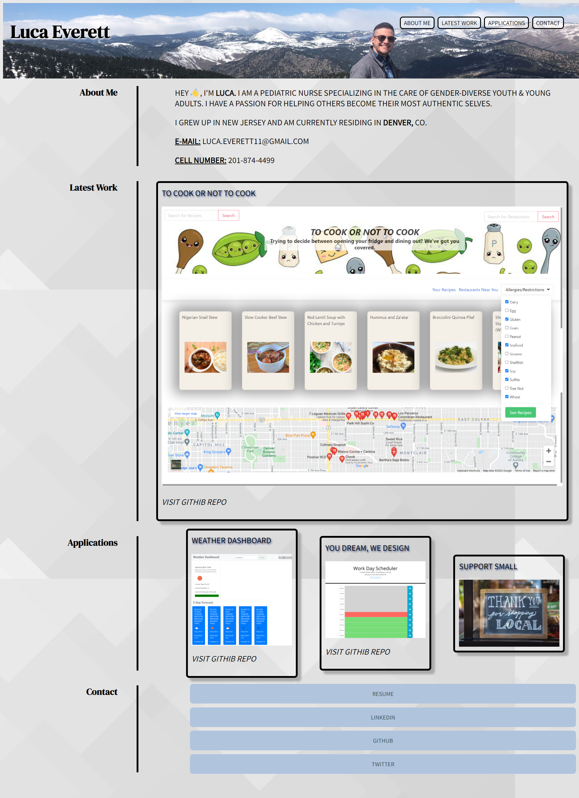

# Portfolio Update

***Updated Portfolio Project:*** My Portfolio showcases my latest project, as well as, 2 homework assignments. I also added information about myself and links that deploy to a PDF version of my resume, my LinkedIn, GitHub, & Twitter. 

This portfolio is an ongoing project & will be addended to include new coding skills and languages that are taught in Bootcamp.

## Completed Steps:

* Created a header with an image of myself & a nav bar that deploys to the specific section
* Created one large application above three smaller apps
* Added contact info (cell number and email) along with links that deploy to my resume, LinkedIn, GitHub, & Twitter
* Added Project 1 under "Latest Work" and also added two exemplary homework assignments (Weather Dashboard & Work Day Scheduler)
*Added applications include the title, screenshot with link to deployed app, as well as, the GitHub Repo link
* Created a polished, responsive layout via mediaqueries
* Adjusted scrolling behavior to smooth
* Added background image & shadows to titles & borders, & also downloaded new fonts

* Created README file with link & screenshot

[Live-site](https://human-exp11.github.io/portfolio/)

